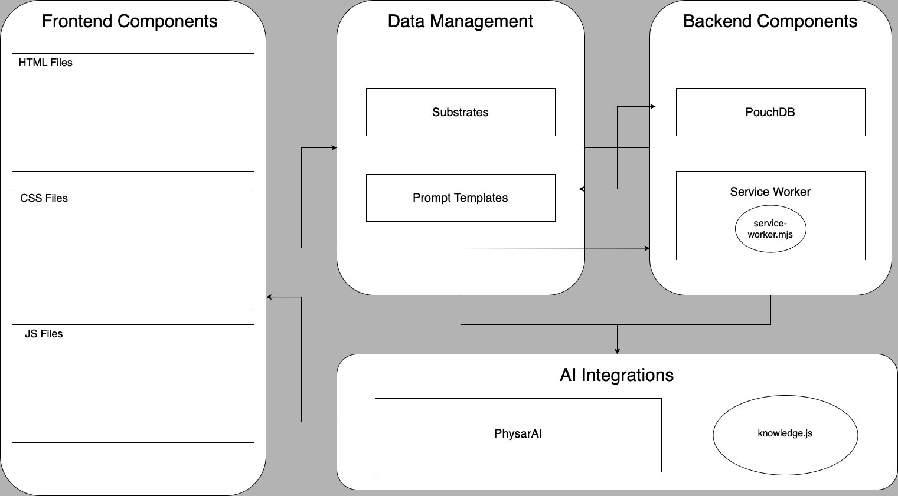

# PhysarAI Documentation

**Purpose**: Provide an overview and essential information to get started with the project. 

**Contents**: 
- [`Introduction`](#introduction): Title and Description

- [`Getting Started`](#getting-started): Prerequisites, Installing and Running the project

- [`Project Structure`](#project-structure): System Design and Architecture

- [`Development Guide`](#development-guide): (Coming Soon)

- [`Advanced Topics`](#advanced-topics): (Coming Soon)

- [`FAQ and Troubleshooting`](#faq-and-troubleshooting): (Coming Soon)

- [`Contribution Guide`](#contribution-guide): How to contribute, coding standards and guidelines, pull request process

- [`Appendix`](#appendix)


---
# PhysarAI DApp


## Introduction

<details>

PhysarAI DApp is a decentralized web application integrating AI functionalities. It is designed to run in a web browser with offline capabilities, allowing users to interact with our state of the art Artificial Intelligence program featuring a completely decentralized infrastructure that runs seamlessly on the client machine.

</details>


## Getting Started

<details>

<summary> ### End-User Guide </summary>

##### Prerequisites
- A Web Browser

##### Installation
- None Required

##### Running the Project
1. Open your browser and go to https://appliedaistudio.github.io/maxwellai-dapp/.

2. Login using the following credentials:
   - Username: guest
   - Password: guest123


### Developer Guide

##### Prerequisites
- Visual Studio Code
- A local web server setup (e.g., Python's HTTP server or Live Preview - A VS Code Extension)
- Basic knowledge of HTML, CSS, and JavaScript

##### Installation
1. Download and Install Visual Studio Code:
  https://code.visualstudio.com/download

2. Install Live Preview:
  Using the Activity Bar on the far left-hand side of VS Code, navigate to the extenstions section and search for "Live Preview". Install the extension of the _**same name**_ that has officially been listed by Microsoft. This extensions allows setting up a local web server within your workspace to preview the app and if required also allows to access the server in an external web browser. 

3. Clone the repository and navigate to project folder:
    - Open a terminal and navigate using `cd` to the folder where you want to save the project.

    - Enter the following commands (make sure `git` is already installed): 

    ```bash
   git clone https://github.com/appliedaistudio/maxwellai-dapp.git
   cd maxwellai-dapp
    ```
   - If you prefer to not use a terminal and commands to carry out this step, you can do the following:
     - Download and Install GitHub Desktop through the following link: https://desktop.github.com/download/
     - Login using your GitHub account.
     - Click on `Add` and in the dropdown menu click on `Clone Repository`.
     - In the popup form click on URL, add the following https://github.com/appliedaistudio/maxwellai-dapp.git. 
     - Choose the Local Path where you want to clone the repository and finally click on clone.

##### Running the Project
1. Run VS Code and open the newly cloned project repository.

2. In the Explorer pane on the left-hand side, open `index.html`.

3. On the top right-hand corner, click on the second button `Open Preview` which is located beside the `Run Code` button.

4. Login using the following credentials and explore the app as you would on a browser:
    - Username: guest
    - Password: guest123


If you prefer to run a local web server by yourself instead:
1. Start the local web server:

   ```bash
   python3 -m http.server
   ```
2. Open your browser and go to http://localhost:8000.

##### Contribution
To get started on contributing to the project (fixing a bug or creating a new feature) refer to the [**`Contribution Guide`**](#contribution-guide) Section.

</details>

## Project Structure

<details>

<summary> ### System Design </summary>

##### 1. **Architecture Overview**
The PhysarAI DApp is designed with a modular architecture that separates concerns across various components, ensuring that each part of the application is well-organized, maintainable, and scalable.

##### 2. **Core Components**
The project is structured into several key components, each responsible for different aspects of the application's functionality:

- **Frontend Components**:
  - **HTML Files**: These files define the structure and layout of the various pages of the application. The `index.html` serves as the main entry point, while others like `login.html`, `tasks.html`, `network.html`, `notifications.html`, and `diagnostics.html` provide interfaces for specific functionalities within the DApp.
  - **CSS Styles**: The CSS files, organized into `base`, `components`, `layout`, and `utils` manage the visual styling of the application. The `base` styles define fundamental elements like typography, while `components` handle the styling of specific UI elements like buttons and menus. `layout.css` manages the overall structure of the pages, while `responsive.css` utility implements responsive design techniques ensuring consistency and optimal performance across different devices and screen sizes.
  - **JavaScript (JS) Files**: The JS files are divided into subdirectories for database management (`db`), user interface (`ui`), utilities (`utils`), and AI-specific functionalities (`ai`). These scripts handle dynamic interactions within the application, such as user authentication, AI interactions, and data management. The `ai` folder contains scripts related to PhysarAI, which is the core AI module integrated into the application.

  Refer to the [**`Development Guide`**](#development-guide) section to dive deeper.

- **Backend Components**:
  - **OpenAI Interaction**: The only core backend component is the DApp's interaction with OpenAI's LLM. The `dapp-settings.json` script and some of the scripts in the `js/ai` subdirectory specifically cater to this.
  - **Service Worker**: The `service-worker.mjs` script functions as the brains of the DApp, operating as a middleman between the frontend and the backend. It handles background tasks, ensures offline functionality, engages the AI for continuous processing, and manages essential data like tasks and notifications. This makes the app responsive and functional even in offline or low-connectivity environments. The service worker is installed and activated as soon as the user is logged in. 
  
  Refer to the [**`Development Guide`**](#development-guide) section to dive deeper.


##### 3. **Data Management**
- The application stores and manages various data states and configurations in the `data/substrates` directory. The folder contains specific data configurations for different aspects of the application, such as aging-in-place, conference productivity, and cybersecurity productivity. Each subfolder contains JSON files that hold structured data used by the application to manage tasks, network configurations, user feedback, and more.
- The `substrate-data-templates` folder contains text files that serve as templates that are fed to an LLM like ChatGPT in order to generate seed substrate data for a new substrate.
- **PouchDB**: A client-side database used for storing and synchronizing data. The `js/db` folder contains initialization scripts for various databases like users, tasks, and notifications. These scripts are essential for setting up and managing local data storage, ensuring that the application can operate offline and synchronize data when a connection is available.

Refer to the [**`Development Guide`**](#development-guide) section to dive deeper.

##### 4. **User Interface (UI)**
The UI is highly modular, with specific styles and scripts dedicated to different components of the application. 

- **Bootstrap**: A popular front-end framework. It has been utilized mainly to compliment the DApp's CSS and JS based design efforts in HTML files and to enable the usage of the design template of a `modal` interface component specifically for the AI chat, notifications and login alerts.
- **UI Controls and Interactions**: Managed by the `ui-controls.js` and related files, these scripts handle the dynamic behavior of the UI elements, such as menus, buttons, and forms.
- **AI Interaction**: The AI-related interactions, managed by `ui-ai-chat.js`, allow users to interact with the AI models integrated into the application. These interactions are designed to be intuitive and responsive, providing real-time feedback to the user.
- **User Authentication**: The User Authentication processes, managed by `ui-auth.js`, allows login management, session management, and access level checks using PouchDB and bcrypt for a secure login system.

Refer to the [**`Development Guide`**](#development-guide) section to dive deeper.

##### 5. **AI Integration**
The `js/ai` directory contains the core AI functionalities, including scripts for managing AI conversations, configuring AI models, and interacting with large language models (LLMs). The PhysarAI module is the main AI component of the application, providing advanced AI capabilities such as natural language processing and knowledge management.

Refer to the [**`Development Guide`**](#development-guide) section to dive deeper.

##### 6. **Security and Performance**
The application leverages several key components to ensure security and optimal performance:
- **bcrypt**: A library used for hashing passwords, ensuring that user credentials are stored securely.
- **Encryption**: Managed by `encryption.js`, this script is a vital part of the DApp’s security infrastructure. It ensures that sensitive data is encrypted using the AES-GCM algorithm before being stored or transmitted, and can be securely decrypted when needed. The module manages the entire encryption and decryption process, using a static key and a random intialization vector (IV) to produce a unique cipher text, this algorithm combines with robust error handling protects user data and maintains the integrity of the application’s security mechanisms.
- **Performance Optimization**: The service worker and caching mechanisms improve the app's performance, especially in environments with limited or unreliable network connectivity. 

Refer to the [**`Development Guide`**](#development-guide) section to dive deeper.

##### 7. **Documentation and Resources**
The `docs` directory contains documentation files that provide detailed information on the application’s setup, usage, and development. This documentation is crucial for onboarding new developers and ensuring that stakeholders have a clear understanding of the system’s capabilities.

</details>

</detail>
<summary>
### System Architecture
</summary>

##### Diagram




### Directory and File Breakdown

##### Root Directory
- `aiTest.html`: Interface for testing AI functionalities in a contained environment. [Not an active part of the DApp]
- `dapp.html`: A previous (initial) iteration of the DApp. [Not an active part of the DApp]
- `diagnostics.html`: Interface for diagnostics features.
- `favicon.ico`: Icon displayed in the browser tab.  
- `index.html`: Main entry point of the application.
- `login.html`: Interface for user login enforcement.
- `manifest.json`: Configuration file for web application manifest.
- `network.html`: Interface for network configurations. Focuses on creating and managing a network of resources.
- `notifications.html`: Interface for managing notifications.
- `service-worker.mjs`: Interface for managing background operations, interacting with physarai, and ensuring that the application remains functional and responsive even in offline conditions.
- `tasks.html`: Interface for task management. Focuses on managing tasks, particularly breaking down goals into actionable items.

##### JavaScript Directory (js/)
- **db/**: Contains database initialization scripts.
  - **data-specific/**:
    - `network-utils.js`: Utility functions for network-related operations.
    - `notification-utils.js`: Utility functions for handling notifications.
    - `task-utils.js`: Utility functions for task management.
  - `db-init-common.js`: Initializes common database configurations and setups.
  - `db-init-dapp-settings.js`: Initializes the DApp settings database.
  - `db-init-general-feedback.js`: Initializes the general feedback database.
  - `db-init-main-content-controls.js`: Initializes the main content controls database.
  - `db-init-menu.js`: Initializes the menu configurations in the database.
  - `db-init-network.js`: Initializes the network configurations database.
  - `db-init-network-feedback.js`: Initializes the network feedback database.
  - `db-init-notification-feedback.js`: Initializes the notification feedback database.
  - `db-init-notifications.js`: Initializes the notifications database.
  - `db-init-task-feedback.js`: Initializes the task feedback database.
  - `db-init-tasks.js`: Initializes the tasks database.
  - `db-init-users.js`: Initializes the users database.
  - `db-init.js`: General script to initialize the entire database setup.

- **ui/**: User interface related scripts.
  - `ui-ai-chat.js`: Manages AI chat interactions.
  - `ui-auth.js`: Handles user authentication.
  - `ui-color-extractor.js`: Extracts colors for UI themes.
  - `ui-controls.js`: Manages UI controls and interactions.
  - `ui-menu.js`: Manages UI menu navigation.

- **utils/**: Utility scripts.
  - `common.js`: Common utility functions used across the application.
  - `encryption.js`: Handles data encryption.
  - `logging.js`: Manages logging functionality.
  - `string-parse.js`: Parses and processes strings.

- **ai/**: Scripts related to PhysarAI.
  - **physarai/**:
    - `physarai-ai-conversations.js`: Manages AI conversations.
    - `physarai-config.js`: Configuration settings for PhysarAI.
    - `physarai-database.js`: Database interactions for PhysarAI.
    - `physarai-helpers.js`: Helper functions for PhysarAI.
    - `physarai-llm-interactions.js`: Manages large language model interactions.
    - `physarai-llm-schema.js`: Schema definitions for large language models.
    - `physarai-main.js`: Main script for PhysarAI functionalities.
  - `knowledge.js`: Accesses external knowledge for AI. [Not an active part of the DApp]

- `dapp-config.js`: Configuration settings for the DApp.
- `dapp.js`: Main script for DApp functionalities.
- `diagnostics.js`: Handles diagnostics features.
- `network.js`: Manages network configurations.
- `notifications.js`: Manages notifications.
- `tasks.js`: Manages task functionalities.

##### Data Directory (data/)
- **substrates/**: Contains various data states and configurations.
  - **aging-in-place/**: 
    - `appliance_inventory.json`: JSON file containing appliance inventory data.
    - `background.jpg`: Background image used in aging-in-place interfaces.
    - `habit_tracking_feedback.json`: JSON file for storing feedback on habit tracking.
    - `habit_tracking_log.json`: JSON file for logging habit tracking data.
    - `incident_user_feedback.json`: JSON file for storing user feedback on incidents.
    - `incidents.json`: JSON file containing incident data.
    - `maintenance_recommendations_log.json`: JSON file for logging maintenance recommendations.
    - `maintenance_user_feedback.json`: JSON file for storing user feedback on maintenance activities.
  
  - **conference-productivity/**:
    - `background.jpg`: Background image used in conference productivity interfaces.
    - `dapp-connectons.json`: JSON file for storing DApp connections data.
    - `dapp-settings.json`: JSON file for storing settings related to the DApp.
    - `general-feedback.json`: JSON file for storing general feedback data.
    - `main-content-controls.json`: JSON file containing main content control settings.
    - `menu-options.json`: JSON file for storing menu options.
    - `network-feedback.json`: JSON file for storing feedback on network configurations.
    - `network.json`: JSON file for storing network configuration data.
    - `notification-feedback.json`: JSON file for storing feedback on notifications.
    - `notifications.json`: JSON file for storing notifications data.
    - `task-feedback.json`: JSON file for storing feedback on tasks.
    - `tasks.json`: JSON file containing task data.

  - **cybersecurity-productivity/**:
    - `dapp-settings.json`: JSON file for storing DApp settings related to cybersecurity productivity.
    - `general-feedback.json`: JSON file for storing general feedback.
    - `main-content-controls.json`: JSON file for storing main content control settings.
    - `menu-options.json`: JSON file for storing menu options.
    - `network-feedback.json`: JSON file for storing feedback on network configurations.
    - `network.json`: JSON file for storing network configurations.
    - `notification-feedback.json`: JSON file for storing feedback on notifications.
    - `notifications.json`: JSON file containing notifications data.
    - `task-feedback.json`: JSON file for storing feedback on tasks.
    - `tasks.json`: JSON file containing task data.

  - **substrate-data-templates/**: Example templates utilized to feed LLMs for generating seed substrate data.
    - `general-feedback.txt`: Template for collecting general feedback.
    - `network-and-feedback.txt`: Template for collecting network feedback.
    - `notifications-and-feedback.txt`: Template for collecting notifications feedback.
    - `tasks-and-feedback.txt`: Template for collecting tasks feedback.

##### CSS Directory (css/)
- **base/**: Contains base styling for the application.
  - `base.css`: Base stylesheet defining fundamental styles for the application.
  - `typography.css`: Stylesheet specifically for managing typography (fonts, headings, etc.).
  - `variables.css`: Stylesheet containing CSS variables used across other stylesheets.

- **components/**: Contains styles for various UI components.
  - `ai-chat-button.css`: Styles for AI chat button elements.
  - `ai-chat.css`: Styles for the AI chat interface.
  - `buttons.css`: Styles for button elements.
  - `cards.css`: Styles for card components.
  - `controls.css`: Styles for UI controls (forms, buttons, etc.).
  - `dapp-settings.css`: Styles for the DApp settings interface.
  - `main-content.css`: Styles for the main content area.
  - `menu.css`: Styles for navigation menus.
  - `sign-in.css`: Styles for the sign-in interface.

- **layout/**: Contains styles related to layout management.
  - `layout.css`: Stylesheet managing the layout structure of the application.

- **utils/**: Contains utility styles.
  - `responsive.css`: Stylesheet for managing responsive design, ensuring the application adapts to different screen sizes.

##### Libraries Directory (lib/)
- **bcrypt/**: Library for password hashing.
  - `bcrypt.min.js`: Minified JavaScript file for the bcrypt library, used for secure password hashing.

- **bootstrap/**: Bootstrap framework for responsive design.
  - **css/**: 
    - `bootstrap.min.css`: Minified CSS file for Bootstrap, providing responsive layout and component styles.
  - **js/**: 
    - `bootstrap.bundle.min.js`: Minified JavaScript bundle for Bootstrap, including necessary plugins like modals, tooltips, etc.

- **fontawesome/**: Font Awesome library for icons.
  - Contains font files and CSS for integrating Font Awesome icons into the application.

- **pouchdb/**: PouchDB library for client-side database management.
  - `pouchdb.min.js`: Minified JavaScript file for PouchDB, enabling client-side database management and syncing with CouchDB.

- **vibrant/**: Vibrant library for color extraction from images.
  - `vibrant.min.js`: Minified JavaScript file for the Vibrant library, used to extract dominant colors from images for dynamic theming.

##### Documentation Directory (docs/)
- Contains documentation files.

##### Fonts Directory (fonts/)
- Contains font files used in the application.

##### Images Directory (images/)
- Contains image files used in the application.


## Development Guide
- **Service Worker**: The service worker is a critical component of the DApp, handling background tasks, caching, and offline functionality. Developers can explore the service worker script (`service-worker.mjs`) to understand its operations and customize its behavior.
  - **Overview of responsibilities**
    - **Service Worker Lifecycle Events**:
      - **Installation**: During the `install event`, the service worker caches essential files such as `index.html`, CSS, and JavaScript. This ensures that the app loads quickly and works offline by caching assets in a versioned cache (`cache-v1`). It uses the `caches.open()` method to store these assets.
      - **Activation**: During the `activate event`, the service worker claims control over all active clients and removes outdated caches. It ensures that old caches (e.g., from previous versions of the app) are invalidated by checking the version (e.g., `cache-v1`) and deleting older cache versions to avoid conflicts.
      - **Fetch Requests Handling**: In the `fetch event`, the service worker intercepts network requests and serves cached responses when available. It falls back to network requests when the requested resource is not available in the cache. For known URLs (e.g., app assets), the worker prioritizes cache-first, improving performance in offline or low-connectivity situations.
      - **Message (Event Driven Message Handling)**: The service worker listens for messages sent from the main thread or other worker threads. It uses the `message event` to receive instructions or data (e.g., engaging the AI, updating tasks, or managing notifications) and responds by performing the necessary actions, specifically triggering the ***engageAI()*** function to initiate AI operations. This allows for two-way communication between the service worker and the main application, facilitating real-time updates and background task execution. Additionally, the event logs the received message for debugging purposes, helping track the communication between the service worker and the main thread. This event allows for dynamic interaction between the frontend and background processes, facilitating real-time AI engagement and other background tasks.
    - **Caching Assets**: During the installation phase, the service worker caches essential files such as the index.html, CSS, and JavaScript files to ensure the application can be loaded quickly and work offline. The cache is managed using the caches API and named `cache-v1`. During the activate event, old caches are purged to ensure that only the latest version of assets is stored.
    - **Managing Notifications**: The service worker regularly checks for pending notifications stored in PouchDB and sends them to the user. It updates the status of notifications from `pending` to `sent` once they are delivered. If a conflict arises during notification status updates (e.g., version conflict in PouchDB), the worker resolves it by fetching the latest version of the document and retrying the update. Notifications contain metadata such as a message, timestamp, and action items. This data is stored in PouchDB and rendered on the UI through the `notifications.js` script. The service worker handles the logic for when and how notifications are fetched, updated, and displayed.
    - **Interacting with PhysarAI: Regular and Real-time AI Engagement**: The service worker engages PhysarAI in the background, processing user insights stored in PouchDB. The data passed between the service worker and PhysarAI includes task data, notifications, and network resource information. The AI processes this data to generate insights, which are used to update tasks, manage notifications, and keep the app's network operations running efficiently. PhysarAI operates at both regular intervals (e.g., every 3 minutes) to handle general updates and in real-time (every 10 seconds) for more immediate feedback and AI interactions. ***Real-time AI engagement*** handles tasks that need immediate processing, while ***regular intervals*** ensure the application stays up-to-date overall.
    - **Pulsing Mechanism**: To visually indicate when the AI is processing, the service worker uses a `pulsing` mechanism that sends `start pulsing` and `stop pulsing` messages to the main thread. This creates a visual feedback loop for the user, showing that background processes are actively running.
    - **Managing Background Tasks**: The service worker continuously runs and schedules tasks in the background, such as updating the UI, sending notifications, and processing data insights, ensuring that the user experience is seamless and responsive.
    - **Communicating with the Main Thread**: The service worker listens for messages from the main application thread and can engage the AI or perform other tasks based on these messages. It also communicates back to the main thread by sending messages to update the UI or notify the user. This two-way communication enables real-time interactions and background operations to enhance the user experience.
    - **Error Handling & Retry Mechanisms**: The service worker includes error handling mechanisms to catch and log errors that occur during background operations. This ensures that any issues are captured and can be addressed promptly, maintaining the stability and reliability of the application.
      - **Conflict Resolution**: When updating data in PouchDB (e.g., notification status), the service worker employs a retry mechanism to handle conflicts. If a document conflict occurs, the service worker retrieves the latest revision of the document and retries the update until successful. This ensures data consistency and prevents failures during updates.
      - **Error Logging**: The service worker logs errors that occur during operations, such as failed fetch requests or database conflicts. These logs are typically sent to the console for debugging purposes, ensuring that developers can quickly identify and resolve issues. The service worker handles errors gracefully, ensuring minimal disruption to the user experience.

- **AI Integration**: Developers can extend the AI capabilities of the DApp by modifying the AI scripts in the `js/ai` directory. These scripts manage AI conversations, interactions with large language models, and knowledge base management.

  - **Key Elements of PhysarAI**
    - **1. Configuration and Initialization**
    	- File: physarai-config.js 
      - Purpose: This file is responsible for the configuration of the AI system, setting important parameters such as the AI profile, caveats, user personality, and the AI’s personality.
      - Key Elements:
        - Personality: maxwellaiPersonality() and userPersonality() functions fetch the AI and user’s personality from the local database (PouchDB).
        - Caveats: The file defines strict instructions that the AI must follow, ensuring certain guidelines are observed.
        - LLM Configuration: The configuration specifies the Large Language Model (LLM) being used, such as GPT-4, and includes response generation rules and task handling.
      - Integration: This configuration integrates with every part of the AI operations, as it shapes the behavior of the AI and defines the interaction parameters.
    - **2. Conversation Management**
      - File: physarai-ai-conversations.js 
      - Purpose: Manages AI responses in conversation scenarios. This file is responsible for generating the AI’s response based on user conversations.
      - Key Elements:
        - AI Response Generation: generateAIResponseToConversation() prepares and sends a conversation prompt to the LLM, then parses and returns the AI’s response.
        - Degraded Mode: The system has a fallback in place to handle cases when the AI is unavailable or an error occurs, returning default responses.
      - Integration: This is critical for real-time user interactions, as it governs how the AI responds to user inputs during conversations. The conversation module integrates tightly with the LLM and the core application logic to provide coherent interactions.
    - **3. Main AI Function**
      - File: physarai-main.js 
      - Purpose: This is the central function of PhysarAI. It manages all interactions between the tools, AI, and user inputs.
      - Key Elements:
        - LLM Prompt Generation: generateReActAgentLLMPrompt() creates a structured prompt for the LLM, outlining tools the AI can use and defining how it should interact.
        - Main AI Loop: The PhysarAI() function runs a loop that processes user inputs, engages the LLM, and executes actions.
        - Error Handling: The function also handles retries and error conditions, such as when the LLM is unavailable.
      - Integration: This file is the centerpiece of the AI system, where all other modules converge. It coordinates tool use, manages interactions with the LLM, and logs actions, ensuring smooth AI operation.
    - **4. Database Interactions**
    	- File: physarai-database.js
      - Purpose: This file manages the interactions between the PhysarAI and the local/remote databases. It retrieves sensitive data like API keys and endpoints for interacting with the LLM.
      - Key Elements:
        - LLM API Key and Endpoint: The functions llmApiKey() and llmEndpoint() fetch and decrypt sensitive data stored in PouchDB, such as API keys and endpoint URLs for the LLM.
	    - Integration: This file is critical for securely accessing necessary resources, such as API keys, that PhysarAI needs to function. It integrates by feeding this information to other modules like the LLM interaction handlers.
    - **5. LLM Interactions**
      - File: physarai-llm-interactions.js 
      - Purpose: This file manages the interactions between PhysarAI and the language model (LLM). It sends user prompts to the LLM and processes the response.
      - Key Elements:
        - promptLLM(): This function sends prompts to the LLM via a POST request, passing the API key, endpoint, prompt, and model as parameters.
      - Integration: It plays a key role by ensuring that user interactions with the AI are processed through the LLM, enabling dynamic response generation based on real-time inputs. This module is central to executing the AI logic within the system.

    - **6. AI Helpers and Actions**
      - File: physarai-helpers.js 
      - Purpose: Provides utility functions to process AI outputs and prepare interaction contexts.
      - Key Elements:
        - Action Extraction: extractActionsAndInputs() parses the LLM’s JSON response, extracting and logging the intended actions.
        - Context Preparation: Functions like prepareContext() build a contextual prompt based on user insights, while prepareMessages() creates structured messages for interaction.
      - Integration: This module works as a pre-processor and post-processor for AI interactions. It builds a proper context and ensures that the AI’s responses are meaningful and aligned with user needs, feeding this back into the main application.

    - **7. Schema Validation**
      - File: physarai-llm-schema.js 
      - Purpose: Defines and validates the structure of the JSON responses received from the LLM.
      - Key Elements:
        - Response Validation: The validateLLMResponse() function checks if the AI’s response adheres to the predefined schema, ensuring that the output is well-formed and actionable.
      - Integration: This file ensures that all responses generated by the LLM are structurally valid before being acted upon. This is crucial for maintaining stability and reliability in the system.
  
  - **Integration into the Overall App Architecture**
    - AI Core: PhysarAI is the mind of the application. It handles dynamic user interactions, processes data, and generates responses based on real-time inputs using advanced language models like GPT-4.
    - Data Management: It relies on PouchDB for managing settings and configuration data securely and efficiently, ensuring offline capability and fast data retrieval.
    - Modular Interaction: Each module—whether it’s for processing conversation responses, fetching knowledge, or managing actions—works independently but communicates with the main PhysarAI function to create a seamless user experience.
    - Real-Time Updates: The system is designed to process real-time inputs and deliver actionable outputs, updating tasks, notifications, and network configurations based on AI insights.

  - **Tool Integration with PhysarAI: Enhancing Capabilities**
    PhysarAI’s intelligence and automation capabilities are enhanced through various tools provided by utility files: notification-utils.js, task-utils.js, and network-utils.js. These tools enable PhysarAI to handle notifications, tasks, and network interactions efficiently. The service worker (service-worker.mjs) plays a critical role in orchestrating these tools and integrating them into PhysarAI’s workflow.
      - **1. Tools in Utility Files**
        - Notification Tools (notification-utils.js):
          - Provides functions for managing notifications (validateNotification, createNotification, updateNotification, etc.).
          - Interacts with the local database (PouchDB) to store, retrieve, and update notifications.
        - Task Tools (task-utils.js):
          - Offers task-related functions (validateTask, createTask, updateTask, etc.).
          - Facilitates task management by interacting with the database, performing CRUD operations, and validating task data.
        - Network Tools (network-utils.js):
          - Manages network configurations and feedback mechanisms, allowing PhysarAI to adapt network-related settings dynamically.
      - **2. Integration via Service Worker**
        - The service worker imports these utility tools and passes them to functions within physarai-main.js, enabling PhysarAI to execute complex operations.
        - Within the service worker, the engageAI function gathers sets of tools (taskTools, notificationTools, networkTools, and commonTools) and injects them into PhysarAI’s main processing loop.
        - For example:
          - updateNotifications: Uses notificationTools to create, update, or validate notifications based on AI insights.
          - updateTasks: Employs taskTools to modify tasks in the database, keeping task management responsive and intelligent.
          - updateNetwork: Utilizes networkTools to adjust network configurations and feedback mechanisms based on real-time analysis.
      - **3. Enhancing AI Capabilities**
        - This tool integration allows PhysarAI to dynamically manage the app’s core functionalities—notifications, tasks, and network settings.
        - By leveraging these tools, PhysarAI can respond to real-time inputs, automate routine tasks, and adapt to changing user or system conditions, thus providing a smarter, more interactive experience for users.
    In summary, the service worker acts as the conductor, calling on the utility tools and passing them into PhysarAI to ensure seamless operation and dynamic interaction with the app’s key components. For new developers, understanding this process is crucial for extending or customizing PhysarAI’s capabilities.


- **Database Management**:
  - The PouchDB scripts in the `js/db` directory handle database initialization and data management. Developers can explore these scripts to understand how data is stored and synchronized in the application. By modifying these scripts, developers can customize data storage, retrieval, and synchronization processes to suit specific requirements.
  - Developers can customize data configurations and states in the `data/substrates` directory to tailor the application to specific use cases or scenarios. By modifying these data files, developers can create new interfaces, functionalities, and interactions within the DApp.

- **UI Customization**: The UI scripts in the `js/ui` directory manage user interface interactions and controls. Developers can customize the UI by modifying these scripts to enhance user experience and functionality.

- **Security Enhancements**: Developers can improve the security of the DApp by enhancing encryption mechanisms, implementing secure authentication processes, and ensuring data privacy and integrity.

- **Performance Optimization**: To optimize the performance of the DApp, developers can explore caching strategies, network configurations, and background operations managed by the service worker. By fine-tuning these components, developers can ensure that the application runs smoothly and efficiently.

## Advanced Topics

## FAQ and Troubleshooting

## Contribution Guide

##### How to Contribute
- **Forking the Repository**: Fork the repository on GitHub and clone it to your local machine.
- **Creating Branches**: Create a new branch for your feature or bug fix.
- **Making Changes**: Implement your changes, following the coding standards below.
- **Committing Changes**: Write clear and concise commit messages (e.g., “Add feature: Implement AI chat interface”).

##### Coding Standards and Guidelines

This section outlines the coding standards and best practices to be followed when contributing to the codebase. The standards are designed to ensure consistency, readability, maintainability, and scalability of the code.

1. **HTML Structure and Best Practices**
- **External Libraries and Styles**: Load external libraries and stylesheets at the top of the `<head>` section. Ensure that all dependencies are documented and version-controlled.
- **Custom CSS and Scripts**: Custom CSS and JavaScript files should be linked after external libraries. Follow a clear directory structure (e.g., `/css/`, `/js/`, `/lib/`).
- **Accessibility**: Use semantic HTML elements like `<nav>`, `<header>`, `<footer>`, `<section>`, and `<article>` to improve accessibility. Always include `aria-labels` and titles where applicable for assistive technologies.

2. **JavaScript Standards**
- **Modular Code**: Use ES6 modules (`import` and `export`) to organize code into logical, reusable components. This promotes maintainability and separation of concerns.
- **Error Handling**: Always include error handling (`try-catch`) for asynchronous operations like database access or network requests. Log errors to the console with descriptive messages.
- **Database Operations**: Use PouchDB for local storage and data management. Ensure that database initialization occurs before any UI operations. Fetch and render data efficiently, utilizing asynchronous functions (`async-await`).
- **Function Documentation**: Each function should be documented with comments explaining its purpose, parameters, and return values. Use clear and descriptive names for functions and variables.

3. **CSS and Styling Guidelines**
- **Naming Conventions**: Follow a consistent naming convention for classes, such as `kebab-case` (e.g., `.ai-chat-button`, `.card-container`). Ensure that class names are descriptive and relevant to their function.
- **Responsive Design**: Use media queries and Bootstrap classes (`d-flex`, `vh-100`, etc.) to create responsive layouts. Test the UI across various devices to ensure compatibility.
- **Variables and Reusability**: Use CSS variables (`:root { --primary-color: #333; }`) for colors, fonts, and other reusable values. This promotes consistency and makes it easier to update styles globally.

4. **Security Considerations**
- **Data Encryption**: Use bcrypt or similar libraries for sensitive data encryption. Always encrypt/decrypt data before storing/retrieving from databases.
- **Input Validation**: Validate all user inputs to prevent security vulnerabilities such as SQL injection or XSS attacks. Sanitize data before processing.
- **Permissions and Notifications**: Always check and request user permissions for notifications. Provide clear instructions and fallback mechanisms if the browser does not support certain APIs.

5. **Testing and Debugging**
- **Console Logs**: Use `console.log` for debugging during development, but remove or comment out unnecessary logs in the production code. Use a logging utility if consistent and detailed logging is required.
- **Browser Compatibility**: Test the application in multiple browsers to ensure consistent behavior. Address any browser-specific issues promptly.

6. **Documentation and Comments**
- **Code Comments**: Use one-line comments whenever possible, placed on lines by themselves. Comment all code, and ensure each major block of code explains its intent. The reader should understand the intent of the code just by reading the comments.
- **Documentation**: Maintain up-to-date documentation for the project, including setup instructions, usage guidelines, and development notes. Keep the documentation in the `docs` directory and update it as the project evolves.

By following these coding standards, we ensure that our codebase remains clean, efficient, and easy to maintain. Consistency in coding practices across the team will lead to a more robust and scalable product.

##### Pull Request Process
- **Submitting a Pull Request**: Push your branch to GitHub and open a pull request.
- **Review Process**: Your pull request will be reviewed by project maintainers. Make necessary changes based on feedback.
- **Merging**: Once approved, your changes will be merged into the main branch.

## Appendix

##### Glossary
- **AI**: Artificial Intelligence
- **DApp**: Decentralized Application
- **Service Worker**: A script that runs in the background and handles caching and other network related operations for offline capabilities
- **API**: Application Programming Interface  

##### Additional Resources
- **Official Documentation**:
  - Bootstrap:
    - https://getbootstrap.com/docs/4.5/getting-started/introduction/
    - https://getbootstrap.com/docs/5.1/getting-started/introduction/

  - PouchDB - https://pouchdb.com/guides/

- **Tutorials and Guides**: Recommended tutorials for further learning.